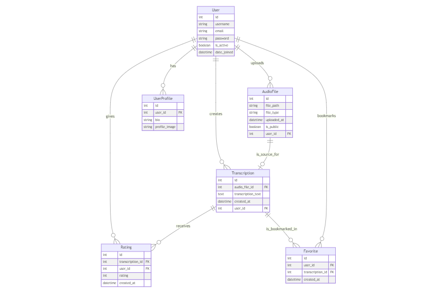

## Used technologies:
**Backend**:
- python
  - django
  - graphQL
  - celery
  - redis
  - PyTorch
  - librosa
- MySQL
- _0auth_
- _payment gateway_

**Frontend**:
- Next.js
- TypeScript
- tailwind.css

**Development**:
- poetry
- docker
- docker-compose

## Requirements
### Functional Requirements

**User Authentication and Authorization**:
   - The system must provide user registration, login, and logout functionalities.
   - Users must be able to reset their passwords via email.

**File Upload**:
   - The system must allow users to upload audio files in MP3 and WAV formats.
   - The system must validate the format and size of uploaded files.

**Transcription Processing**:
   - The system must process uploaded audio files to generate piano transcriptions.
   - Transcriptions should be saved in a format that is easy to read and edit.

**Transcription Management**:
   - Users must be able to view, edit, and delete their transcriptions.
   - Users must be able to set the visibility of their transcriptions to public or private.

**Search Functionality**:
   - The system must provide basic search capabilities for transcriptions based on title, composer, and visibility.

**Rating System**:
   - Users must be able to rate transcriptions.
   - The system must calculate and display the average rating for each transcription.

**Bookmarking**:
   - Users must be able to bookmark their favorite transcriptions.
   - Users must be able to view and manage their bookmarked transcriptions.

### Non-Functional Requirements

**Performance**:
   - The system must process transcriptions within a reasonable time frame (e.g., less than 5 minutes for a 10-minute audio file).

**Usability**:
   - The user interface must be intuitive and easy to navigate.
   - The system must provide clear instructions and feedback to users.

**Reliability**:
   - The system must be reliable with minimal downtime.
   - The system must provide robust error handling and recovery mechanisms.

**Security**:
   - The system must protect user data with appropriate security measures.
   - The system must use secure authentication mechanisms.

**Compatibility**:
   - The system must be compatible with major web browsers (e.g., Chrome, Firefox).

**Maintainability**:
   - The codebase must be well-documented and modular to facilitate maintenance and updates.
   - The system must be easy to deploy and scale.

## ERD diagram:
